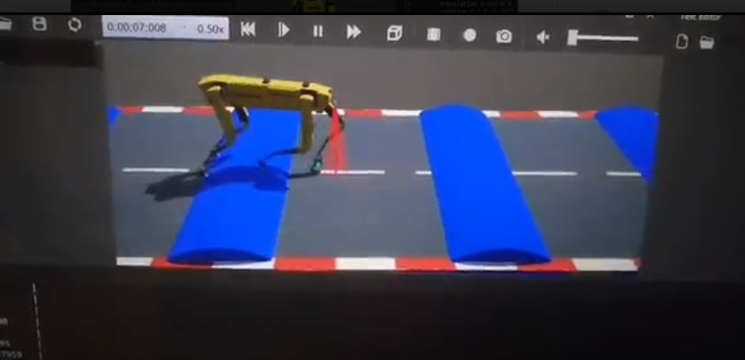

# RL for walking robot

## About / Synopsis

* This project is to learn to create a custom environment in webots to test out a quadruped robot environment for reinforcement learning.
* It is a 3D version of the 2D env [Bipedal walker](https://gym.openai.com/envs/BipedalWalker-v2/).
* I chose to use stable baselines for this project as the goal of this project was simply to create a robot environment that is easily accessible for others.
* SAC was chosen out of DDPG, SAC and PPO as it yields better results based on what i written and tested in my other github project for bipedal walker.

## Installation

* Install webots in your system and use the spot model (protos) in the protos folder.
* Install stable-baselines3 in your python environment. <https://github.com/DLR-RM/stable-baselines3>
* Install open ai gym in your python environment. <https://gym.openai.com/docs/>

## Usage
There are 2 controllers in this world.
* spot_controller - To test out if the controllers are running correctly in your system
* rl_controller - To run the spot robot using the trained model of RL controller.

### Screenshots

### Requirements
* 970 Graphics card or higher

### Improvements for the future
In the future i'd probably pair up a camera with yolov5 for feature selection then pass those features to the RL algorithm to train to walk as this project is just a simple imitation of upgrading the 2D environment of Bipedal walker.
